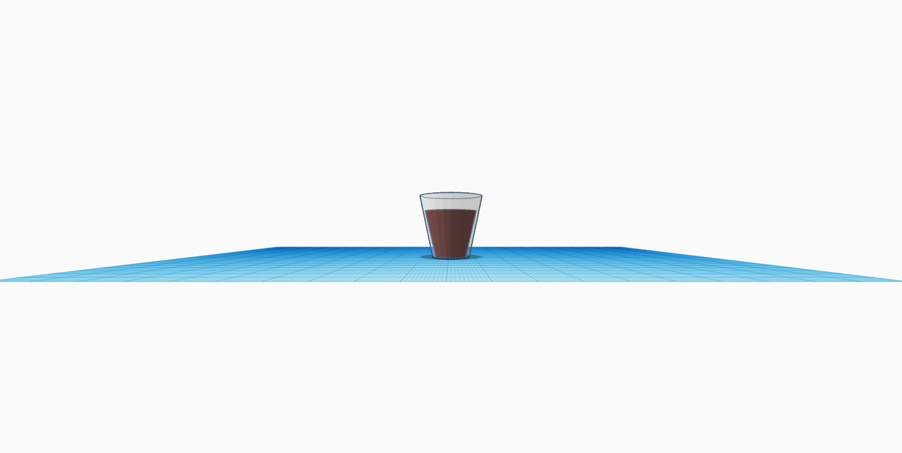

# Lavori

Bicchiere in 3D realizzato con Blender. E' stata un' avventura simpatica ma non con pochi ostacoli ma alla fine forse l'unico difetto è che il bicchiere sembra sia posizionato in aria.

[Scarica la foto](bicchiere/bicchiere.jpg)

Ho voluto poi sperimentare Tinkercad nel realizzare sempre un bicchiere.  
 
 [Scarica la foto](bicchiere/tink.bicchiere.jpg)
